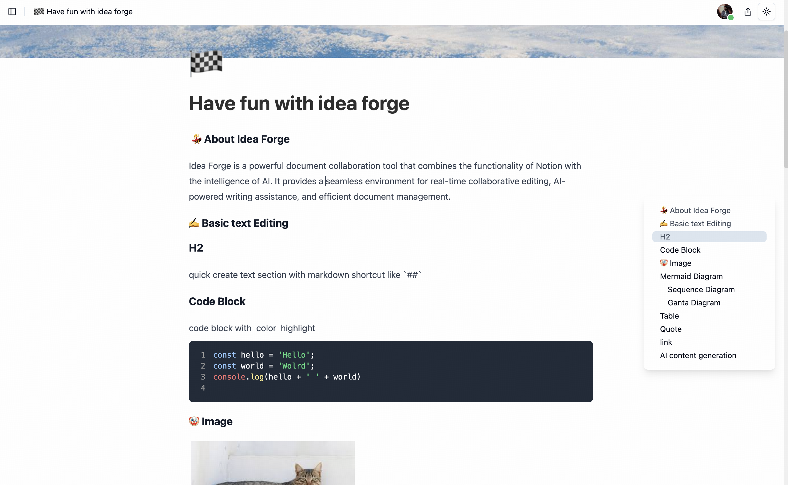
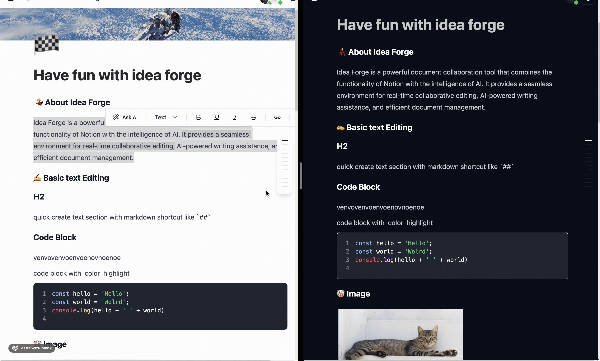
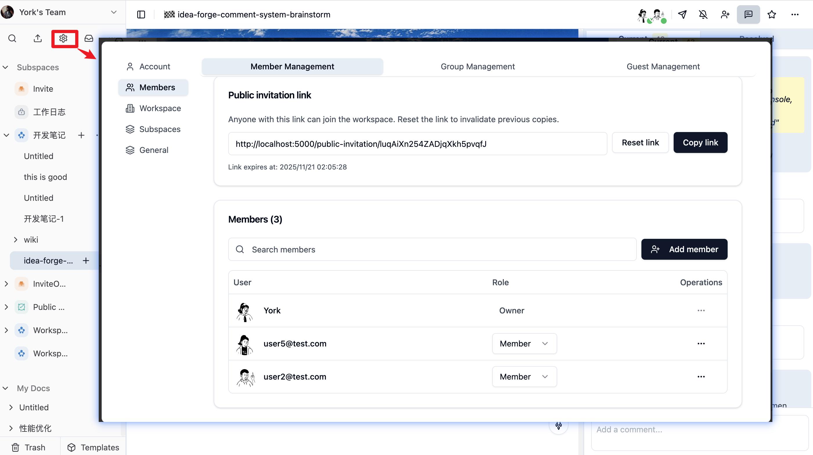
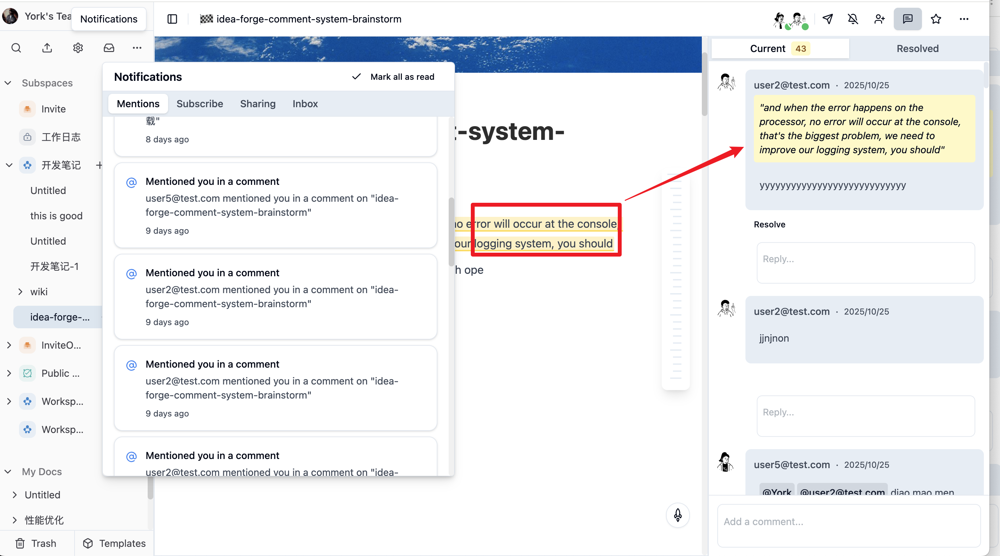
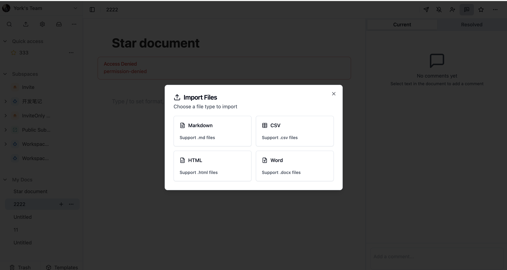

简体中文 | [English](README.md)

<h1 align="center">Idea Forge</h1>

`Idea Forge` 是一个企业级文档协作平台，结合了类 Notion 的功能和 AI 能力以及高级工作区管理。它为团队提供了完整的解决方案，包括多租户工作区、精细的权限控制、实时协作编辑、AI 驱动的写作辅助和全面的文档组织。

## ✨ 主要特性

- 🏢 **多工作区 & 子空间** - 5 种子空间类型，支持拖拽移动文档
- 🔐 **高级权限系统** - 多级权限层次结构，支持继承和限时访问
- ⚡ **实时协作** - 实时光标和无冲突编辑
- 💬 **评论 & 表情回应** - 支持嵌套讨论和表情符号回应
- 🔔 **智能通知** - 带过滤的提醒和需要操作的提示
- 👥 **群组 & 访客访问** - 团队组织和外部协作
- 🌍 **公开分享** - 带统计和过期控制的分享链接
- 🤖 **AI 写作助手** - 基于上下文的内容生成
- 🔧 **富文本编辑器** - 表格、任务、图片、图表、代码块
- 📝 **文件导入/导出** - 支持多种格式的导入和导出
- 💯 **免费开源** - MIT 许可证，支持自托管

立即体验 Idea Forge：[ideaforge.link](https://ideaforge.link/public-invitation/XbwoWc9AC3Vdi9z7jgy4EY8q)

> 更多功能正在路上：思维导图、白板、PDF 导出、公开分享自定义域名，敬请期待。

## 📸 功能展示

### 文档编辑

创建包含多种元素的丰富文档，包括文本、表格、任务列表、图片和 Mermaid 图表。

<div align="center">
  <figure>
    <a target="_blank" rel="noopener">
       
    </a>
  </figure>
</div>

### AI 写作助手

只需按 Space 即可激活 AI 驱动的写作建议。


### 实时协作

通过共享文档与团队实时协作。



### 工作区 & 子空间管理（近期更新）

支持多工作区组织，提供 5 种子空间类型实现灵活的项目管理。



> 根据你查看本文档的时间，你可能暂时无法在生产环境看到工作区系统，因为它仍需最终测试和检查。

### 文档权限 & 继承（近期更新）

多级文档权限层次结构，支持级联继承和精细访问控制。工作区 > 子空间 > 群组 > 用户


### 通知 & 评论系统（近期更新）

通过智能通知保持信息同步，支持嵌套讨论和表情符号回应。



### 文件导入（近期更新）

支持拖拽导入文件，后台处理和任务状态跟踪。



## 🛠️ 技术栈

**后端：** NestJS • PostgreSQL • Prisma • Redis • Hocuspocus • BullMQ • S3 • JWT OAuth
**前端：** React • TypeScript • TipTap • Shadcn UI • TailwindCSS • Zustand
**协作：** Yjs CRDT • WebSocket • Socket.io
**基础设施：** Turbo • pnpm • Biome • Vitest • Playwright
**AI：** OpenAI API 流式响应

## 🐳 自托管部署

使用 Docker 在你自己的服务器上部署 Idea Forge - 无需克隆仓库！

```bash
# 一键安装
curl -fsSL https://raw.githubusercontent.com/chenxiaoyao6228/idea-forge/master/scripts/deploy/deploy-quick-start.sh | bash

# 配置并部署
cd ~/idea-forge-deploy
cp env.secrets.example .env
nano .env  # 更新域名、密钥和存储配置
./deploy.sh
```

**包含内容：** Docker 部署 • SSL 证书 • 自托管存储 • 生产就绪

**[📖 完整部署指南](./docs/development/CN/deployment.md) 

> ⚠️ 国内用户：请使用 Docker 镜像加速或科学上网。参考 [Docker 配置指南](./docs/development/EN/docker.md)

## 🚀 开发环境搭建

1. 从 [Docker Desktop](https://www.docker.com/products/docker-desktop/) 下载并安装适用于你操作系统的版本

> ⚠️ 国内用户注意：由于 Docker 被墙，请使用 Docker 镜像加速或科学上网拉取镜像

2. 启动开发环境

```bash
# 安装依赖并设置本地 Docker 环境
pnpm install && pnpm run setup

# 启动开发服务器
pnpm run dev
```

更多可以参考 [开发文档](./docs/development/CN/README.md)

## 🗺️ 发展路线图

我们正在持续改进 Idea Forge。以下是即将推出的功能：

### 即将推出
- 🧠 **思维导图** - 可视化思维和头脑风暴
- 🎨 **白板** - 协作可视化画布
- 🎯 **模板** - 预设文档模板
- 📄 **PDF 导出** - 带格式的 PDF 文档导出
- 🌐 **自定义域名** - 为公开分享使用你自己的域名
- 🔌 **API 集成** - 连接第三方服务
- 📊 **分析仪表板** - 工作区和文档分析

## 🤝 参与贡献

我们欢迎所有形式的贡献！以下是你可以帮助的方式：

- 🐛 报告 bug 和问题
- 💡 提出新功能建议
- 🎨 改进 UI/UX
- 📚 完善文档
- 🌍 添加翻译

在提交拉取请求之前，请阅读我们的[贡献指南](CONTRIBUTING.md)。

## 📄 许可证

Idea Forge 基于 [MIT 许可证](LICENSE) 开源。
