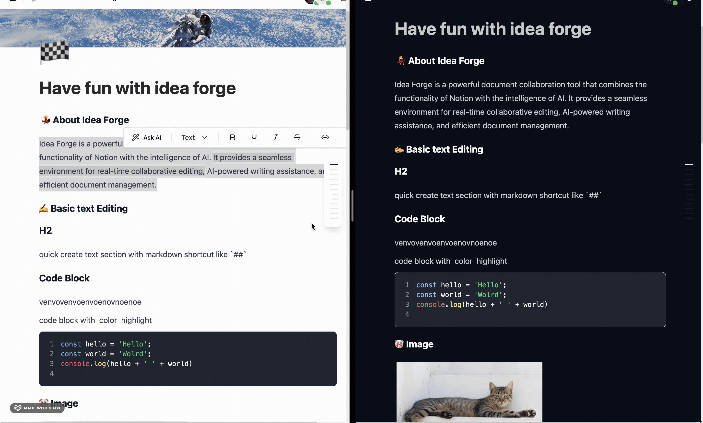

English | [简体中文](README-CN.md)

<h1 align="center">Idea Forge</h1>

Idea Forge is a powerful document collaboration platform that combines Notion-like functionality with AI capabilities. It offers a seamless environment for real-time collaborative editing, AI-powered writing assistance, and intuitive document management.

## ✨ Key Features

- 💯 Free and Open Source with self-hosting support
- 🔧 Rich document elements (text, tables, task lists, images, Mermaid diagrams)
- 🤖 AI-powered writing assistance
- 👥 Real-time collaboration
- 🎨 Customizable themes, cover images, and emojis
- 🌐 Multilingual support (English, Chinese, and more)
- 📝 Markdown keyboard shortcuts, import and export markdown

Try Idea Forge now at [ideaforge.link](https://ideaforge.link/)

## 📸 Screenshots

### Document Editing

Create rich documents with multiple elements including text, tables, task lists, images, and Mermaid diagrams.

<div align="center">
  <figure>
    <a target="_blank" rel="noopener">
       
    </a>
  </figure>
</div>

### AI Writing Assistant

Simply press Space to activate AI-powered writing suggestions.


### Real-time Collaboration

Work together with your team in real-time by sharing documents.



## 🛠️ Tech Stack

Idea Forge is built with modern technologies:

- **Backend**: NestJS, PostgreSQL, Redis, Hocuspocus, Prisma, S3
- **Frontend**: React, TypeScript, TailwindCSS, Shadcn UI, Tiptap
- **AI Integration**: OpenAI API

## 🚀 Development Setup

1. Install [Docker Desktop](https://www.docker.com/products/docker-desktop/) for your operating system

> ⚠️ Note for users in China: Due to Docker being blocked, please use Docker image acceleration or a VPN to pull images

2. Configure Tiptap Pro Extension

   a. Register and login at [tiptap.dev](https://tiptap.dev/)
   b. Get your token from [cloud.tiptap.dev/pro-extensions](https://cloud.tiptap.dev/pro-extensions)
   c. Create a `.npmrc` file in the project root with:

```bash
link-workspace-packages=true

@tiptap-pro:registry=https://registry.tiptap.dev/
//registry.tiptap.dev/:_authToken={your_token}
```

3. Start Development Environment

```bash
# Install dependencies and setup local Docker environment
pnpm install && pnpm run setup

# Start the development server
pnpm run dev
```

## 🤝 Contributing

We welcome all contributions! Here's how you can help:

- 🐛 Report bugs and issues
- 💡 Propose new features
- 🎨 Improve UI/UX
- 📚 Enhance documentation
- 🌍 Add translations

## 📄 License

Idea Forge is licensed under the [MIT License](LICENSE).
