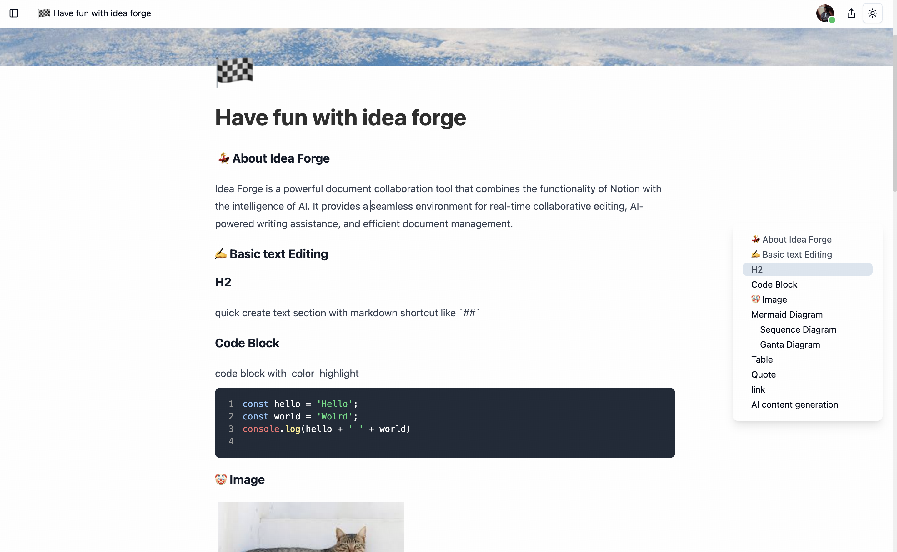

English | [简体中文](README-CN.md)

<h1 align="center">Idea Forge</h1>

`Idea Forge` is an enterprise-grade document collaboration platform that combines Notion-like functionality with AI capabilities and advanced workspace management. It offers a complete solution for teams with multi-tenant workspaces, sophisticated permission controls, real-time collaborative editing, AI-powered writing assistance, and comprehensive document organization.

## ✨ Key Features

- 🏢 **Multi-Workspace & Subspaces** - 5 subspace types for flexible organization with drag and drop to move docs
- 🔐 **Advanced Permissions** - multi-level hierarchy with inheritance and time-limited access
- ⚡ **Real-Time Collaboration** - Live cursors and conflict-free editing
- 💬 **Comments & Reactions** - Threaded discussions with emoji reactions
- 🔔 **Smart Notifications** - Filtered alerts with action-required support
- 👥 **Groups & Guest Access** - Team organization and external collaboration
- 🌍 **Public Sharing** - Shareable links with analytics and expiration
- 🤖 **AI Writing Assistant** - Context-aware content generation
- 🔧 **Rich Editor** - Tables, tasks, images, diagrams, code blocks
- 📝 **File import/export Support** - Import/export various format
- 💯 **Free & Open Source** - MIT license with self-hosting

Try Idea Forge now at [ideaforge.link](https://ideaforge.link/)

> And more features & elements are on the way: Mindmap, Whiteboard, PDF Export, Custom domains for public sharing, please stay tuned.

## 📸 Screenshots

### Document Editing

Create rich documents with multiple elements including text, tables, task lists, images, and Mermaid diagrams.

<div align="center">
  <figure>
    <a target="_blank" rel="noopener">
       
    </a>
  </figure>
</div>

### AI Writing Assistant

Simply press Space to activate AI-powered writing suggestions.


### Real-time Collaboration

Work together with your team in real-time by sharing documents.


### Workspace & Subspace Management(Recent update)

Organize your work across multiple workspaces with 5 subspace types for flexible project organization.


> You might not see the workspace system in production depends on the time you view this doc since it still needs final testing and check

### Document Permission & Inheritance (Recent update)

multi-level doc permission hierarchy with cascading inheritance and granular access control. workspace > subspace > group > user


### Notification & Comment System (Recent update)

Stay informed with smart notifications and have threaded discussions with reactions.


### File Import (Recent update)

Import files with drag-and-drop, background processing, and job status tracking.


## 🛠️ Tech Stack

**Backend:** NestJS • PostgreSQL • Prisma • Redis • Hocuspocus • BullMQ • S3 • JWT OAuth
**Frontend:** React • TypeScript • TipTap • Shadcn UI • TailwindCSS • Zustand
**Collaboration:** Yjs CRDT • WebSocket • Socket.io
**Infrastructure:** Turbo • pnpm • Biome • Vitest • Playwright
**AI:** OpenAI API with streaming

## 🐳 Self-Hosting

Deploy Idea Forge on your own server with Docker - no repository clone needed!

```bash
# One-line install
curl -fsSL https://raw.githubusercontent.com/chenxiaoyao6228/idea-forge/master/scripts/deploy/deploy-quick-start.sh | bash

# Configure and deploy
cd ~/idea-forge-deploy
cp env.secrets.example .env
nano .env  # Update your domain, secrets, and storage
./deploy.sh
```

**What you get:** Docker-based deployment • SSL certificates • Self-hosted storage • Production ready

**📖 Full deployment guide:** [docs/development/EN/deployment.md](./docs/development/EN/deployment.md)

> ⚠️ China users: Use Docker mirror acceleration or VPN. See [docker setup guide](./docs/development/EN/docker.md)


## 🚀 Development Setup

1. Install [Docker Desktop](https://www.docker.com/products/docker-desktop/) for your operating system

> ⚠️ Note for users in China: Due to Docker being blocked, please use Docker image acceleration or a VPN to pull images


2. Start Development Environment

```bash
# Install dependencies and setup local Docker environment
pnpm install && pnpm run setup

# Start the development server
pnpm run dev
```

## 🗺️ Roadmap

We're continuously improving Idea Forge. Here's what's coming next:

### Upcoming Features
- 🧠 **Mind Maps** - Visual thinking and brainstorming
- 🎨 **Whiteboard** - Collaborative visual canvas
- 🎯 **Templates** - Pre-built document templates
- 📄 **PDF Export** - Export documents to PDF with formatting
- 🌐 **Custom Domains** - Use your own domain for public sharing
- 🔌 **API Integrations** - Connect with third-party services
- 📊 **Analytics Dashboard** - Workspace and document analytics


## 🤝 Contributing

We welcome all contributions! Here's how you can help:

- 🐛 Report bugs and issues
- 💡 Propose new features
- 🎨 Improve UI/UX
- 📚 Enhance documentation
- 🌍 Add translations

Please read our [Contributing Guidelines](CONTRIBUTING.md) before submitting pull requests.

### For Maintainers: Creating Releases

To create a new release with automated Docker image builds:

```bash
# 1. Ensure you're on master with latest changes
git checkout master
git pull origin master

# 2. Create and push a version tag
git tag v1.2.3
git push origin v1.2.3

# 3. GitHub Actions automatically:
#    ✅ Builds Docker image
#    ✅ Pushes to Docker Hub (version tag + latest)
#    ✅ Creates GitHub Release with changelog
```

The release will be available at:
- Docker Hub: `chenxiaoyao6228/idea-forge:1.2.3` and `latest`
- GitHub Releases: https://github.com/chenxiaoyao6228/idea-forge/releases

## 📄 License

Idea Forge is licensed under the [MIT License](LICENSE).
