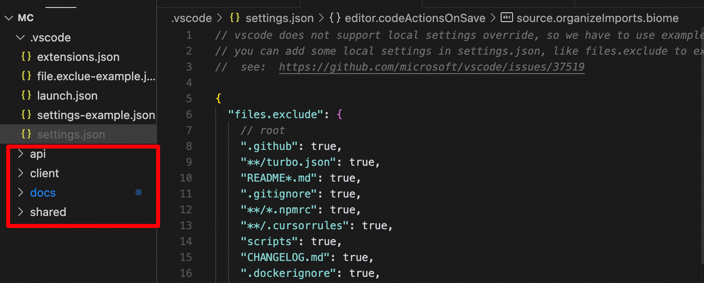

## Debug

介绍项目里面的一些调试技巧

### 组件调试

依赖了 `React-dev-inspector` 开发调试, `shift + Z + X` 可快速跳转到组件所在的代码

### vscode 调试

`vscode`点击`F5`开始调试, 会自动打开浏览器, 并跳转到 `http://localhost:5000`,

接着你就可以在 `vscode` 中打断点调试了, 像和浏览器一样

### file-exclude 隐藏文件

项目文件比较多, 但是常规开发需要关注的文件并不多, 所以可以隐藏一些文件

`file.exclue-example.json` 是 `vscode` 的文件排除配置, 拷贝到 `.vscode/settings.json` 中添加, 这样目录就很清新了

