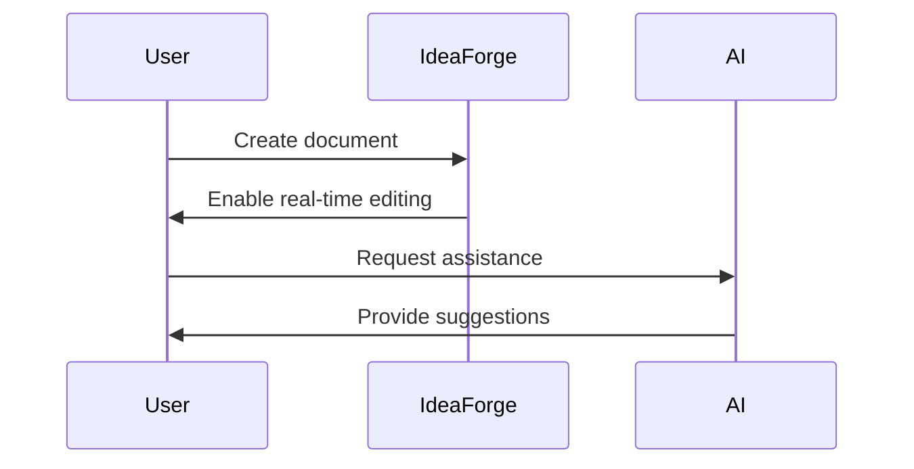

## 👋 Getting Started

Idea Forge is a powerful document collaboration platform that combines Notion-like functionality with AI capabilities. Here's what you can do:

### 📝 Basic Editing

Start typing anywhere or use markdown shortcuts:

- Type `#` for headings
- Type `>` for quotes
- Type `- ` for bullet lists
- Type `/` for more commands

### 💫 Rich Content

#### Code Blocks

```typescript
const greeting = "Welcome to Idea Forge!";
console.log(greeting);
```

#### Diagrams



#### Tables

| Feature                 | Description                               |
| ----------------------- | ----------------------------------------- |
| Real-time Collaboration | Work together with your team in real-time |
| AI Writing Assistant    | Get smart suggestions as you type         |
| Rich Elements           | Add code, diagrams, tables, and more      |

## 👥 Collaboration

Share your documents with team members and:

- Edit together in real-time
- See who's currently viewing
- Track changes and contributions


## 🎨 Customization

- Add cover images to your documents
- Choose custom emojis
- Select from multiple themes
- Organize with nested pages

Want to see more coming elements? Type “/“ to see the list of available elements.

### 🤖 AI Assistant

Press **Space** anywhere to activate AI suggestions. Our AI can help you:

- Continue writing
- Generate ideas
- Improve your text
- Answer questions


## 🚀 Ready to Start?

1. Try editing this document
2. Create a new page
3. Invite your team members
4. Explore AI features

Need help? Check out our documentation or join our community!

---

_Idea Forge - Where Ideas Come to Life_ 🔨✨
